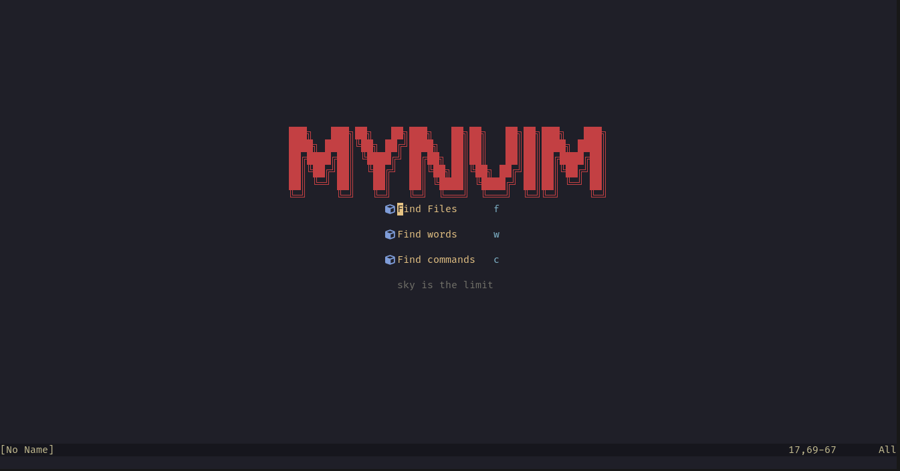
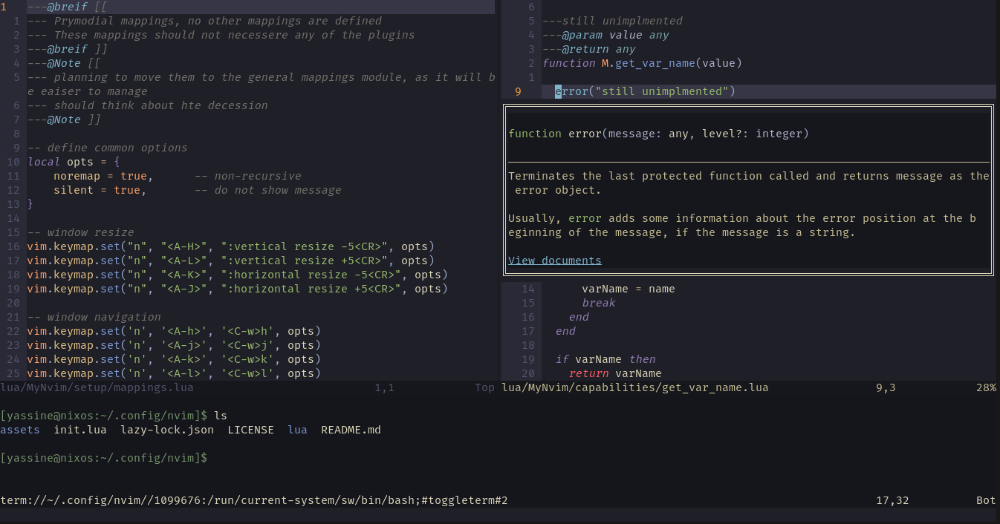

<h1 align="center">MyNvim</h1>

|||
|------|-------|
|||

This is MyNvim, which, as the name implies, meant to be user oriented Nvim configuration, or atelast that's what it seems to be

# How To Use It
First, you need to backup your exesting configuration if you already have one, you can do so by running the following command:
```bash
mv ~/.config/nvim ~/.config/nvim_
```
Next, clone this repository and move its content under the neovim configuration direcotry:
```bash
git clone https://github.com/yassinebenarbia/MyNvim.git && mkdir -p ~/.config/nvim && mv ./MyNvim/* ~/.config/nvim/ && rm -rfd ./MyNvim
```
optionaly you can add `--depth=1` if you don't want to clone old commits.  
Finaly, just open neovim, the lazy installer should pupup with the a list of the currently installing plugins.

# Worth knowing
* you are on your own to install the requiered LSP for your beloved language, It should be as simple as running `:mason` and then installing it from there (tip: use `/` to search)
    * on [NixOS](https://nixos.org/) it's not that simple, you have to manually link it or just install it from your nix configuration file
*  searching capabilities may not work on [NixOS](https://nixos.org/), since they depends on [ripgrep](https://github.com/BurntSushi/ripgrep), please consider installing it on your machine to make use of that capability.

# TODO(s)
- [ ] Create a documentation for this project.
	- [ ] Document all keybinds in each method
	- [ ] Document how to install/add new plugins
- [ ] Review and refactor old code
- [ ] Document undocumented functions

# Note
> Currently I'm on a job hunt, so this project may not get enough mantainence, so please, be patient and if you believe that this project deserves more care, make a pull request and I'll be more than happy reviewing it
